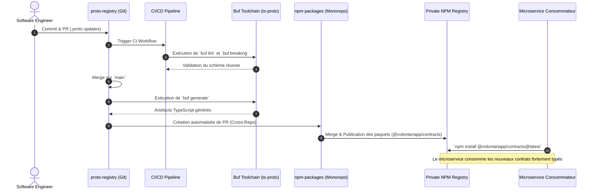

# Architecture & Design Document

## Architecture Overview

Le projet `proto-registry` adopte une **Architecture Orientée Contrat (Contract-First Architecture)**, ancrée dans les principes du **CQRS (Command Query Responsibility Segregation)**. 

Plutôt que de concevoir les interfaces de communication à travers les microservices ou de s'appuyer sur du code source comme source de vérité (Code-First), cette architecture positionne les fichiers Protocol Buffers (.proto) comme l'alpha et l'oméga de l'intégration système. La stricte séparation des modèles d'écriture (Commands) et de lecture (Queries) permet une scalabilité indépendante des schémas de données, une réduction du couplage fort et facilite la mise en œuvre de l'Event Sourcing ou d'API asynchrones au niveau de l'infrastructure sous-jacente de Volontariapp.

## Directory Structure

L'arborescence est conçue pour maximiser l'isolation des domaines (Domain-Driven Design) tout en maintenant un standard strict d'organisation des fichiers par domaine.

```text
proto-registry/
├── proto/
│   └── volontariapp/               # Namespace global et scope de package Protobuf
│       ├── common/                 # Modèles transversaux et primitives partagées
│       │   ├── pagination.proto    # Types génériques de pagination (ex: PaginationRequest)
│       │   └── timestamp.proto     # Abstractions autour des marqueurs de temps
│       └── [domain_name]/          # Isolation par Bounded Context (ex: event, user)
│           ├── [domain].proto            # Modèles de base, l'Entité pure (ex: Event)
│           ├── [domain].command.proto    # Modèles d'intentions d'écriture (ex: CreateEventRequest)
│           ├── [domain].query.proto      # Modèles d'intentions de lecture (ex: GetEventRequest)
│           ├── [domain].responses.proto  # Définitions des payloads de retour et DTO de réponses
│           └── [domain].services.proto   # Définitions des RPC gRPC (le contrat d'interface réseau)
├── buf.yaml                        # Configuration du module Buf (règles de linting)
└── buf.gen.yaml                    # Configuration du pipeline de génération (plugins, ex: ts-proto)
```

## Data Flow & Component Communication

La séquence ci-dessous illustre le flux de mise à jour des contrats, de la conception par l'ingénieur jusqu'à l'adoption par les services consommateurs finaux via le registre de dépendances.



## Design Decisions & Trade-offs

### 1. Centralisation des Contrats (SSOT)
- **Décision** : Regrouper l'intégralité des contrats gRPC dans un dépôt distinct (`proto-registry`) plutôt que de les répartir dans les microservices ou de les conserver dans le monorepo applicatif principal.
- **Compromis** : Introduit un surcoût opérationnel mineur (obligation de modifier le registre centralisé avant d'implémenter le code backend), mais garantit une absence totale d'API Drift et force une phase de conception amont réfléchie pour chaque évolution de l'API.

### 2. Découpage CQRS à l'échelle des fichiers `.proto`
- **Décision** : Séparer systématiquement chaque domaine en 5 fichiers `.proto` (Entity, Command, Query, Responses, Services).
- **Compromis** : Augmente la verbosité de l'arborescence et le nombre de fichiers à maintenir. En contrepartie, cela prévient la création de fichiers monolithiques massifs, rendant la lecture, les revues de code (PRs) et l'évolution des contrats (notamment la gestion des conflits Git) beaucoup plus fluides au sein des équipes.

### 3. Couplage avec `ts-proto` et le framework NestJS
- **Décision** : Générer non seulement des interfaces agnostiques mais aussi des décorateurs spécifiques à NestJS (via `nestJs=true` dans `buf.gen.yaml`).
- **Compromis** : L'outillage de ce dépôt est partiellement couplé au choix de framework (NestJS) des microservices de Volontariapp. Cela accélère drastiquement l'intégration côté backend, au détriment d'une stricte neutralité technologique. Si Volontariapp migre vers un autre framework ou langage (ex: Go, Rust), le pipeline `buf.gen.yaml` devra être étendu avec de nouveaux plugins.

### 4. Délégation de la publication au monorepo `npm-packages`
- **Décision** : Ne pas publier directement sur le registre NPM depuis `proto-registry`, mais ouvrir une Pull Request automatisée vers le dépôt `npm-packages`.
- **Compromis** : Ajoute une étape asynchrone (attente de fusion dans un autre dépôt) mais délègue intelligemment le versioning sémantique et la publication aux outils spécialisés (comme Changesets) déjà configurés dans `npm-packages`. Cela permet également aux ingénieurs de revoir le code TypeScript généré avant sa distribution finale.
